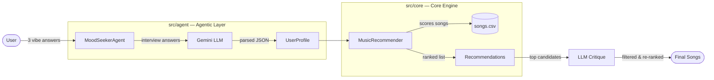

# Applied AI Music Recommender

My system follows a **Modular Agentic Pattern**:

- **The Agent (`src/agent/`):** Acts as the interface, using an LLM to translate natural language into a schema.
- **The Core (`src/core/`):** A high-performance recommendation engine that handles the math and data filtering.
- **The RAG Layer (`src/rag/`):** (Placeholder) Designed to eventually retrieve song lyrics to improve mood matching.

## System Architecture

### How the modules interact

1. **`src/agent/` drives the workflow.** `MoodSeekerAgent.run()` orchestrates everything — it interviews the user, calls the LLM, invokes the core engine, and runs the critique step.
2. **`src/core/` is pure logic, no LLM dependency.** The agent passes a `UserProfile` dataclass (defined in `src/core/models.py`) to `MusicRecommender.recommend()`, which scores songs from `songs.csv` by genre, mood, and energy proximity. It returns a ranked list of `Recommendation` objects.
3. **The LLM acts as a translator and a judge.** It appears twice: first to parse free-text answers into a structured `UserProfile`, then to critique whether the recommender's output actually matches the user's vibe — filtering out poor fits.
