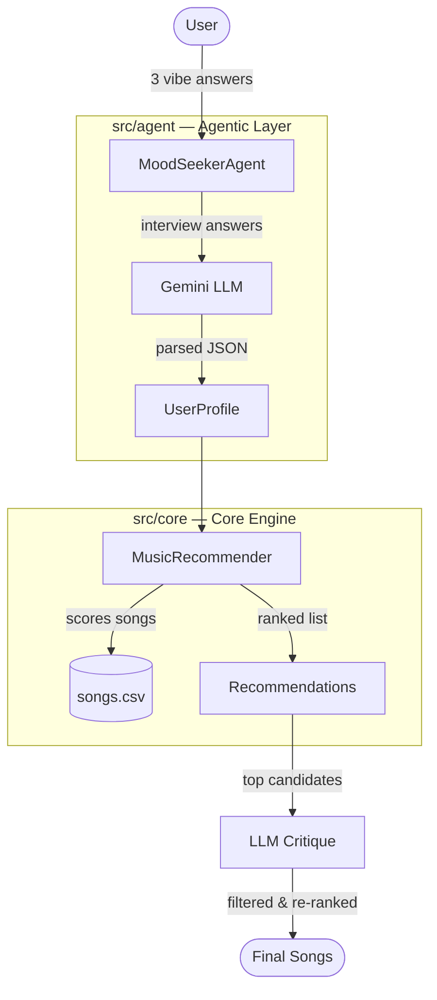

# Applied AI Music Recommender

My system follows a **Modular Agentic Pattern**:

- **The Agent (`src/agent/`):** Acts as the interface, using an LLM to translate natural language into a schema.
- **The Core (`src/core/`):** A high-performance recommendation engine that handles the math and data filtering.
- **The RAG Layer (`src/rag/`):** (Placeholder) Designed to eventually retrieve song lyrics to improve mood matching.

## Setup

```bash
pip install -r requirements.txt
```

Copy `.env.example` to `.env` and add your Gemini API key:

```bash
cp .env.example .env
# Then edit .env and set: GEMINI_API_KEY=your_key_here
```

Run the basic recommender (no API key needed):

```bash
python -m src.main
```

Run the agentic Mood-Seeker (requires `GEMINI_API_KEY`):

```bash
python -m src.main agent
```

Run the reliability tests:

```bash
python -m tests.test_agent_reliability
```

## Sample Interaction

Below is a sample run from the **Exhausted Office Worker** test persona:

```text
============================================================
  Persona: Exhausted Office Worker
============================================================
  Answers: ['Terrible. Back-to-back meetings and I just want to zone out.', '2', 'ambient']
  Extracted: mood=melancholy, energy=0.2, genres=['ambient', 'electronic', 'classical'],
             context=User had a terrible day filled with meetings and wants to relax.

  Top 5 recommendations:
    1. Nuvole Bianche by Ludovico Einaudi (score=1.0)
    2. Clair de Lune by Debussy (score=0.637)
    3. Weightless by Marconi Union (score=0.625)
    4. Breathe Me by Sia (score=0.6)
    5. The Night We Met by Lord Huron (score=0.587)

  Self-Critique Confidence: 5/5
  Reasoning: The recommendations are an excellent fit. The system correctly
  identified the user's low energy and melancholy mood, prioritizing ambient
  and classical music that aligns with the user's desire to relax.
```

The LLM correctly interpreted "Terrible. Back-to-back meetings" as low energy and a melancholy mood, then the core engine surfaced calming ambient and classical tracks — exactly what this persona needed.

## System Architecture



### How the modules interact

1. **`src/agent/` drives the workflow.** `MoodSeekerAgent.run()` orchestrates everything — it interviews the user, calls the LLM, invokes the core engine, and runs the critique step.
2. **`src/core/` is pure logic, no LLM dependency.** The agent passes a `UserProfile` dataclass (defined in `src/core/models.py`) to `MusicRecommender.recommend()`, which scores songs from `songs.csv` by genre, mood, and energy proximity. It returns a ranked list of `Recommendation` objects.
3. **The LLM acts as a translator and a judge.** It appears twice: first to parse free-text answers into a structured `UserProfile`, then to critique whether the recommender's output actually matches the user's vibe — filtering out poor fits.

## Evaluation Results

We tested the system's reliability by running three simulated personas through the `MoodSeekerAgent` and validating the LLM's profile extraction against expected values.

| Persona | Mood Check | Energy Check | Self-Critique Confidence |
| --- | --- | --- | --- |
| Exhausted Office Worker | PASS | PASS | 5/5 |
| Hyped Gym-goer | PASS | PASS | 4/5 |
| Melancholic Student | PASS | PASS | 4/5 |

**Overall Pass Rate: 100%** for both mood and energy extraction across all three personas. The LLM's self-critique step scored every recommendation set at 4/5 or 5/5, confirming that the final song lists are highly relevant to each user's stated vibe.

## System Reflection

Using an LLM as a "normalizer" between the user and the recommendation engine is what makes this system robust. A traditional keyword-matching approach would struggle with input like "Amazing! Just crushed a personal record at the gym" — there's no explicit mention of energy or mood. But the LLM understands the intent behind the words, correctly mapping that statement to `mood=happy` and `energy=0.9`. This translation layer means users can speak naturally without worrying about matching the system's internal schema, and the core engine still receives clean, structured data to score against. It turns a rigid filtering problem into a conversational experience.

The 4/5 confidence scores reveal an interesting trade-off between vibe accuracy and genre strictness. For example, the Gym-goer persona asked specifically for hip-hop, but the system also recommended "Blinding Lights" (pop) and "Don't Stop Me Now" (rock) because they matched the user's high energy and happy mood almost perfectly. The self-critique acknowledged these as strong fits despite the genre mismatch — and arguably, a user who just crushed a PR would enjoy those tracks. This shows that the system prioritizes overall vibe over rigid genre filtering, which is a deliberate design choice: mood and energy matter more than labels. A future improvement could let users specify how strictly they want genre enforced, giving them control over this balance.
